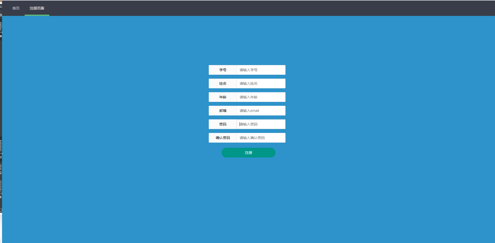
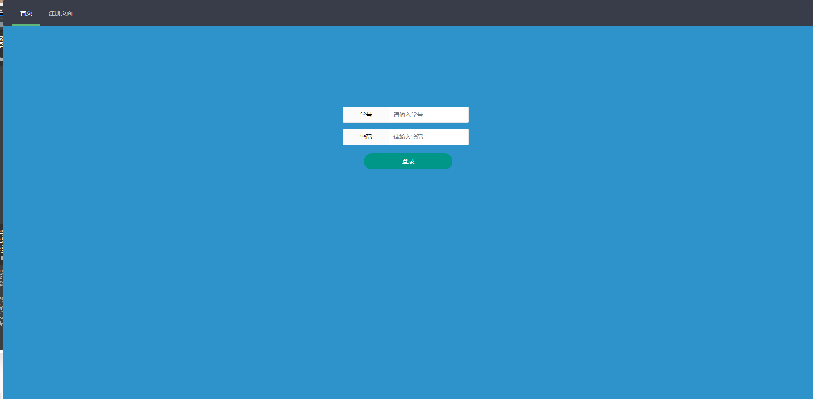
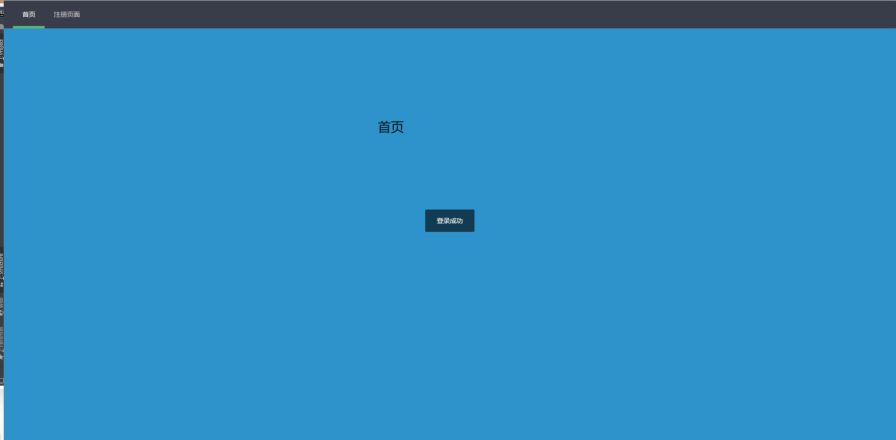

# 简介

后台采用springboot框架，前端采用layui框架，简单地实现了注册与登录功能。

# 使用方法

1. 将src/main/resources/路径下的application.properties文件修改成自己的mysql数据库信息
2. 执行建表文件夹中的student.sql文件，生成student表
3. 执行com/fan/register/路径下RegisterApplication.java文件中的main函数
4. 访问http://127.0.0.1:8080/，出现如下网站页面说明程序运行成功

# 效果图

- 注册页面

  

- 登录页面

  

- 登录成功页面

  
  
  # 联系人
  
  邮箱：291622538@qq.com
  
  昵称：不凡不弃

